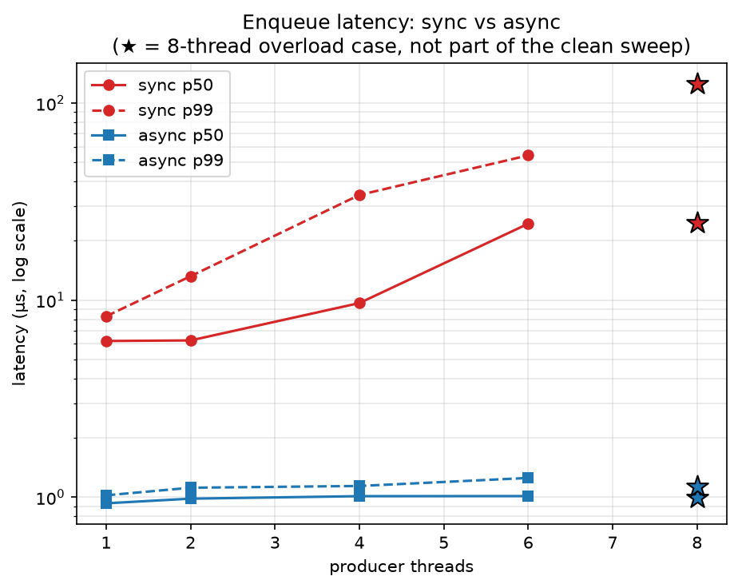
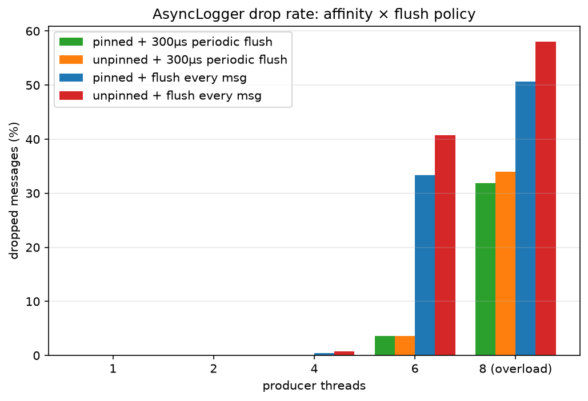
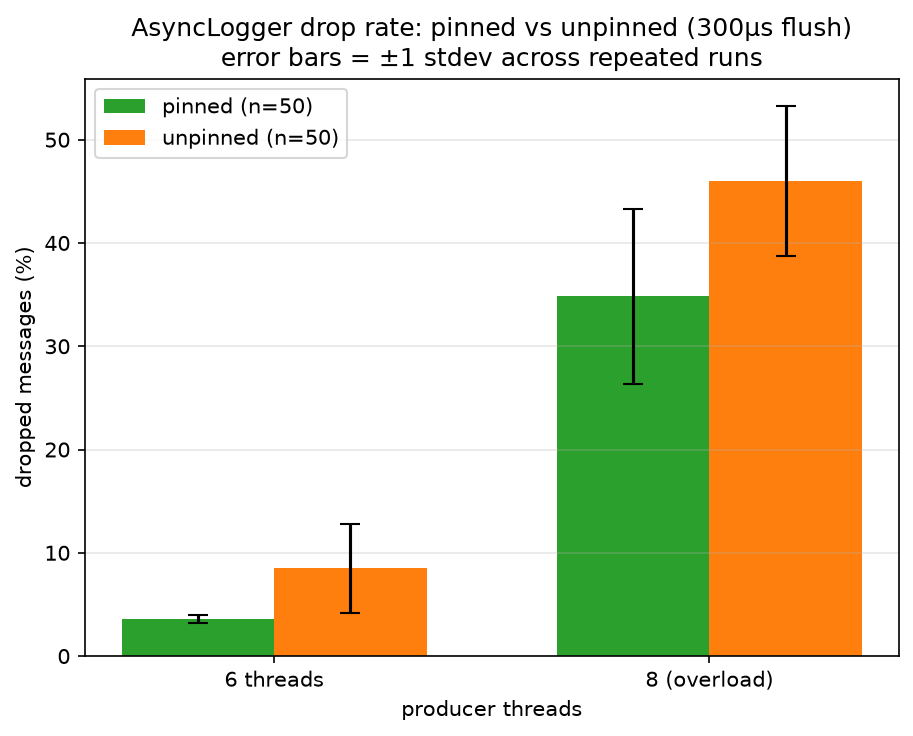

# async-low-latency-logger

A ring-buffer-backed async logger for C++: application threads never block
on logging, no matter how slow the underlying I/O is. Built to measure and
document, precisely, how much latency that buys back versus a naive
synchronous logger under load.

```text
producer thread 1 ┐
producer thread 2 ┼──▶  MPSC ring buffer  ──▶  consumer thread  ──▶  log file
producer thread N ┘     lock-free, fixed        deferred format,
                         slots, drop-on-full     periodic flush
```

## Results at a glance

Async logging is **8-20x faster** than sync at every percentile
measured, and stays flat (~1µs) under load where sync's tail blows out
to hundreds of microseconds. The more interesting finding: switching
the consumer's flush policy from per-message to a 300µs periodic
interval cut dropped messages by roughly 10x — and a 50-run repeated
comparison found CPU affinity's own effect on drop rate *likely* real
but not statistically proven at that sample size, reported as such
rather than overclaimed from a single run. Full methodology, data, and
the affinity statistics are in [Results](#results) below.



## Design

- **MPSC ring buffer, fixed-size slots.** Multiple producer threads log
  concurrently into one shared, preallocated, power-of-2-sized ring buffer.
  A single background consumer thread drains it.
- **Deferred formatting.** The hot path (producer) copies raw bytes into a
  slot — no heap allocation, no syscalls, no string formatting, no locks.
  Formatting and the actual write to disk happen later, on the consumer
  thread.
- **Drop-on-full, not block-on-full.** Since the producer must never block,
  a full buffer means the newest message is dropped and an atomic counter
  is incremented, rather than the producer stalling.
- **Cache-line-padded cursors.** Producer/consumer cursors are padded to
  avoid false sharing between threads.

## Status / Roadmap

- [x] Milestone 1 — sync baseline logger + benchmark harness (scaffolded,
      implementation TODO)
- [x] Milestone 2 — SPSC ring buffer (lock-free)
- [x] Milestone 3 — generalize to MPSC
- [x] Milestone 4 — overflow policy (drop-on-full + counter)
- [x] Milestone 5 — consumer thread: deferred formatting, buffered write.
      (Flush-per-message is still the policy — flagged in code as a
      follow-up once milestone 7 has numbers showing what it costs.)
- [x] Milestone 6 — correctness under concurrency (ThreadSanitizer stress tests)
- [x] Milestone 7 — benchmark harness: open-loop load, latency percentiles, sync vs async
- [x] Milestone 8 — OS tuning (CPU isolation, IRQ affinity) on the benchmark host
- [x] Milestone 9 — run benchmarks, collect results, plots
- [ ] Milestone 10 — this README's Hardware / OS Tuning / Results sections filled in
- [ ] Stretch — NUMA-aware placement, io_uring writer, structured logging

## Build

```bash
cmake -S . -B build -DCMAKE_BUILD_TYPE=Debug
cmake --build build -j
./build/async_low_latency_logger
./build/bench_logger
```

## Hardware specs

_TBD — filled in at milestone 10 with `lscpu`/`dmidecode` output from the
benchmark host._

## OS tuning

The benchmark host is the author's own interactive Manjaro desktop (Intel
i7-9700KF, 8 physical cores, no SMT, single socket / single NUMA node) —
not a dedicated benchmark box. Rather than boot-time `isolcpus`/
`nohz_full` kernel parameters (which would require a GRUB edit and a
reboot, and permanently remove cores from general use whenever the
machine is booted that way), tuning here is **runtime-only** and fully
reversible per run:

- **Core layout.** Core 0 is left for the OS/desktop session. Cores 1-7
  are reserved for the benchmark: core 1 for `AsyncLogger`'s consumer
  thread, cores 2-7 for up to 6 producer threads (one core each).
- **Process steering.** `user.slice`/`system.slice`'s cgroup v2
  `cpuset.cpus` is temporarily confined to core 0 (best-effort — skipped
  if the `cpuset` controller isn't delegated), so other processes don't
  land on the reserved cores.
- **IRQ affinity.** Movable IRQs (`/proc/irq/*/smp_affinity_list`) are
  redirected to core 0. Kernel-managed MSI-X IRQs reject the write and
  are left alone.
- **CPU governor.** Set to `performance` on cores 1-7 only (via
  `cpupower`); core 0 stays on the system default.
- **Thread pinning.** `AsyncLogger`'s consumer thread and each
  benchmark producer thread self-pin via `sched_setaffinity`
  (`alll::Affinity` in `include/logger/async_logger.hpp`), targeting a
  fixed core layout hardcoded in `benchmarks/bench_main.cpp`
  (`BenchmarkConfig::consumer_cpu`, `BenchmarkConfig::producer_cpu_base`)
  that matches this script's default reservation. Unlike the rest of
  the tuning, this isn't
  conditional on running under the script — `bench_logger` always
  attempts it. Running it directly (as CI does) is still harmless:
  pinning to a CPU that exists but isn't specially reserved just
  succeeds trivially, and pinning to one that doesn't exist just fails
  and is silently ignored.

Run it with:

```bash
sudo scripts/run_bench_tuned.sh
```

Tuning (governor/IRQ/cpuset steering) is applied once and left in place
for a repeated batch of runs via an optional 1th argument — useful for
characterizing run-to-run variance rather than trusting a single sample
per configuration:

```bash
sudo scripts/run_bench_tuned.sh build/bench_logger 10 1-7 0
```

Each run's `bench_results.csv` is saved separately under
`benchmarks/results/repeats/<timestamp>/run_NN.csv` instead of
overwriting the previous one; a single run (the default, `iterations=1`)
still just leaves `bench_results.csv` in place as before.

Everything mutated (governor, IRQ affinity, cgroup cpusets) is reset to
known defaults on exit — including on failure or Ctrl-C, via a trap. If
the script itself is killed with `SIGKILL` or the host crashes mid-run,
the trap never runs and tuning is left applied; recover by hand with
the same commands the trap runs (see the comment at the top of
`scripts/run_bench_tuned.sh`).

This intentionally falls short of the exclusivity guarantee real
`isolcpus` provides — unbound kernel threads aren't confined by the
cgroup steering step, and if `cpuset` delegation isn't already present
on a given system, that step is skipped rather than forced. CI does not
use this script; it only smoke-tests that `bench_logger` runs.

## Benchmark methodology

`benchmarks/bench_main.cpp` measures **producer-side enqueue latency
only** — how long the `log()` call itself takes to return, not how long
the message takes to actually reach disk. That's the number that
matters to the application thread calling it; what happens after is the
consumer's problem, by design.

Each producer thread runs an **open-loop** load generator: it issues one
`log()` call on a fixed schedule (50 kHz per thread) regardless of how
long the previous call took, rather than waiting for one call to finish
before issuing the next. A closed-loop generator (issue, wait, repeat)
would silently hide tail latency — exactly when the system falls behind,
it backs off and stops offering the load that would have exposed it.
Open-loop keeps the offered load constant no matter how the system
responds.

Each run: 1,000 warmup calls (excluded from the sample), then 100,000
measured calls per thread, sorted to compute percentiles
(`benchmarks/latency_stats.hpp`).

**Scenarios:**
- **Clean sweep** — `{1, 2, 4, 6}` producer threads, run for both
  `SyncLogger` and `AsyncLogger`. Under `scripts/run_bench_tuned.sh`
  (see "OS tuning" above), 6 producers + `AsyncLogger`'s 1 consumer
  thread exactly fills the 7 cores reserved for the benchmark — no
  oversubscription.
- **Overload** — a separate 8-thread case that alone equals this
  machine's physical core count, leaving no core free for the consumer
  or the OS. Kept out of the clean sweep's trend line (labeled
  `sync_overload`/`async_overload` in each results CSV) since it's
  deliberately pathological, not a data point on it.
- **Affinity × flush policy** — beyond the thread-count sweep, two
  independent knobs were each run with and without: whether producer
  and consumer threads are pinned (see "OS tuning"/"Thread pinning"
  above), and how often `AsyncLogger`'s consumer flushes to disk —
  after *every* message (the original policy, milestone 5's TODO) vs.
  a fixed 300µs interval (`kFlushInterval` in `src/logger/async_logger.cpp`
  — chosen over a shorter 50µs interval also tried during development,
  which measured worse). Each of the 4 combinations is its own CSV in
  [`benchmarks/results/`](benchmarks/results/):
  `pinned_flush_periodic_300us.csv`, `unpinned_flush_periodic_300us.csv`,
  `pinned_flush_every_message.csv`, `unpinned_flush_every_message.csv`.
- **Repeated runs (affinity, specifically)** — a single run per
  configuration isn't enough to tell a real effect from this desktop's
  own run-to-run noise, so the pinned-vs-unpinned comparison at 300µs
  flush was re-run 10 and then 50 times each via
  `scripts/run_bench_tuned.sh`'s iteration argument, saved to
  [`benchmarks/results/repeats/`](benchmarks/results/repeats/)
  (`n10_*`/`n50_*` directories) and aggregated with
  `benchmarks/plots/aggregate_repeats.py`, which reports each gap in
  units of pooled standard deviation — below ~1-2σ isn't distinguishable
  from noise at these sample sizes.

## Results

Measured on the tuned host (see "OS tuning"); raw data in
[`benchmarks/results/`](benchmarks/results/). Regenerate the plots
below with:

```bash
python3 -m venv benchmarks/plots/.venv   # first time only
benchmarks/plots/.venv/bin/pip install -r benchmarks/plots/requirements.txt
benchmarks/plots/.venv/bin/python benchmarks/plots/plot_results.py           # latency
benchmarks/plots/.venv/bin/python benchmarks/plots/plot_comparison.py        # drop rate
benchmarks/plots/.venv/bin/python benchmarks/plots/plot_affinity_repeats.py  # affinity, n=50

# affinity repeated-run comparison as text (stdlib only, no venv needed)
python3 benchmarks/plots/aggregate_repeats.py \
  benchmarks/results/repeats/n50_pinned_flush_periodic_300us \
  benchmarks/results/repeats/n50_unpinned_flush_periodic_300us
```


**Async wins on latency everywhere** — roughly 8-20x lower p50 and p99
than sync at every thread count measured, and the gap *widens* under
contention: sync's tail degrades sharply as threads increase, while
async's barely moves. This is the design's core value proposition
actually landing: producer threads never block on I/O, so their latency
stays flat regardless of what the consumer or the disk is doing. This
holds across all four affinity/flush combinations, not just the one
plotted above — pinning and flush policy affect the *consumer's* drain
rate, not the producer's enqueue cost, so p50/p99 stay in roughly the
same ~1µs range no matter which of the 4 configs was used.



**Drop rate is a different story, and flush policy is by far the
dominant lever.** At 6 threads: 33-41% dropped with a per-message
flush (33% pinned, 41% unpinned) — switching to the 300µs periodic
flush alone cuts that to ~3.6-8.5%. At the 8-thread overload case the
same switch roughly halves the drop rate (51-58% down to 32-46%). This
comparison isn't close — every single-run gap here is a large multiple
of the run-to-run noise characterized below, so it doesn't need the
repeated-run treatment to trust.

**Affinity's effect is smaller, and a single run isn't enough to
resolve it — which is exactly why it got the repeated-run treatment.**
A single pinned-vs-unpinned run at 300µs flush originally looked
identical (3.57% either way at 6 threads) — that reading doesn't hold
up. Aggregating 50 runs of each
(`benchmarks/results/repeats/n50_pinned_flush_periodic_300us/` vs.
`n50_unpinned_flush_periodic_300us/`):

| | pinned (n=50) | unpinned (n=50) | gap |
|---|---:|---:|---:|
| drop rate @ 6 threads | 3.56% ± 0.39 | 8.49% ± 4.29 | 1.62σ |
| drop rate @ overload | 34.84% ± 8.48 | 46.01% ± 7.25 | 1.42σ |



The error bars visibly overlap at both points — that's the picture
version of "not past 2σ." But look at their *width*: pinned's bar is
tight at 6 threads while unpinned's spans roughly 4-13%, which is the
variance finding below in one glance.

Unpinned's mean is now consistently more than double pinned's at 6
threads, and the gap *grew* going from 10 to 50 runs (1.09σ → 1.62σ)
rather than shrinking toward zero — the direction you'd expect if this
is a real effect that a single run was too noisy to resolve cleanly.
But at both sample sizes it stays just under the ~2σ bar for calling it
resolved, so the honest conclusion is: **likely real, not proven** —
getting it past 2σ would take roughly another 3-4x the samples
(~150-200 runs), which wasn't worth the runtime for this project.

The clearer, better-supported finding is **variance, not the mean**:
pinned's drop rate is far more *consistent* run to run than unpinned's
— stdev of 0.39 vs. 4.29 at 6 threads, an ~11x difference that held up
identically at both n=10 and n=50. Whatever affinity's exact effect on
the average turns out to be, it clearly makes the consumer's behavior
more predictable, which for a low-latency logger may matter as much as
the average itself.

One side effect of disabling `Affinity` for the unpinned batch: it also
unpins *producer* threads (the same call is used for both `SyncLogger`
and `AsyncLogger` benchmarks), and at the 8-thread overload case two of
the eight producer pin targets (cpus 8 and 9, from
`producer_cpu_base=2`) don't exist on this 8-core machine — so even the
"pinned" overload run has 2 of 8 producer threads effectively floating.
Worth knowing before reading too much into the overload numbers
specifically. `SyncLogger`'s own p50 at overload showed the single
strongest effect in this whole comparison (24.5µs pinned vs. 32.5µs
unpinned, 6.59σ at n=50) — a reminder that this toggle isn't isolated
to `AsyncLogger`'s consumer the way the rest of this section frames it.

None of the drop-rate story above is the ring buffer's fault — it's
lock-free and sized generously at 65,536 slots. It's the consumer's
flush call: on every single message, that's a `write()` syscall the
consumer can't get ahead of once producers arrive faster than disk I/O
completes; on a
periodic interval, most messages just append to the C++ stream buffer
and the syscall cost gets amortized across many of them. This is the
concrete, now-measured cost of the original policy — the number
milestone 5's comment was waiting on — and confirmation that batching
the flush was the right fix.

## Testing

GoogleTest suite in `tests/` (fetched via CMake's `FetchContent`, no system
install needed), covering `SpscRingBuffer`, `MpscRingBuffer`, `SyncLogger`,
and `AsyncLogger`. Concurrency tests check both correctness (no lost,
duplicated, or reordered messages under contention) and, for `AsyncLogger`,
a specific shutdown-hang regression (the destructor must not block forever
if the consumer thread is idle when shutdown is requested).

```bash
# normal build
cmake -S . -B build -DCMAKE_BUILD_TYPE=Debug
cmake --build build -j
ctest --test-dir build --output-on-failure

# ThreadSanitizer build
cmake -S . -B build-tsan -DCMAKE_BUILD_TYPE=Debug -DALLL_ENABLE_TSAN=ON -DALLL_BUILD_BENCHMARKS=OFF
cmake --build build-tsan -j
ctest --test-dir build-tsan --output-on-failure
```

Both configurations run in CI on every push.
